## 简介

&nbsp;&nbsp;安全运维工具箱是一款面向安全运维场景的集成化利器，融合了资产管理、资产测绘、漏洞检测、配置核查、弱口令检测、批量化运维、漏洞跟踪、报告生成以及日志审计等核心功能模块。实现安全运维服务标准化、自动化，助力用户构建高效、精准、可复用的安全运维体系。

[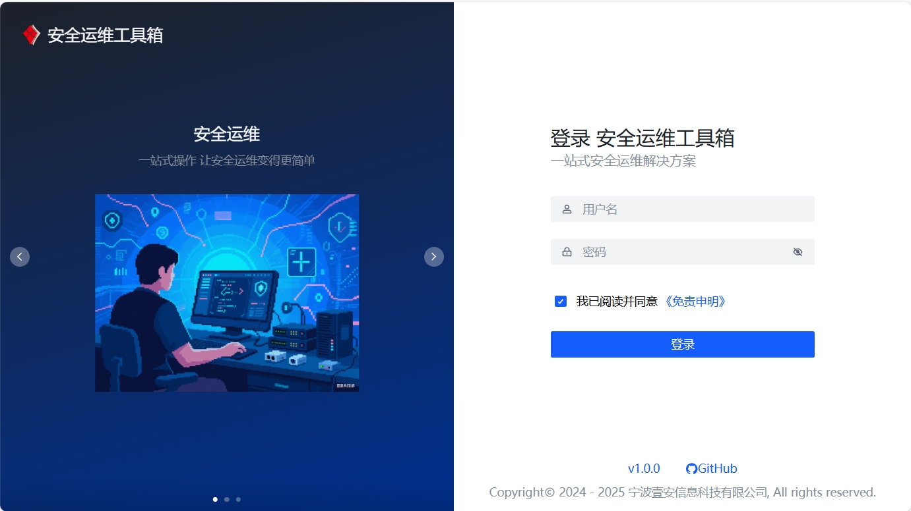](https://www.bilibili.com/video/BV1rzTTzsEB3/)

功能预览视频：https://www.bilibili.com/video/BV1rzTTzsEB3/

## 主要功能

### 1. 资产管理

&nbsp;&nbsp;提供主机和应用资产的全生命周期管理，支持资产状态追踪（新增/变更/下线）、资产录入、批量导入、批量属性变更、资产打标、资产导出等功能。基于资产管理的安全检测服务体系，以资产为中心开展各项安全检测服务（如：资产测绘、配置核查、弱口令检测、漏洞检测等），通过多源数据融合构建多维资产档案。
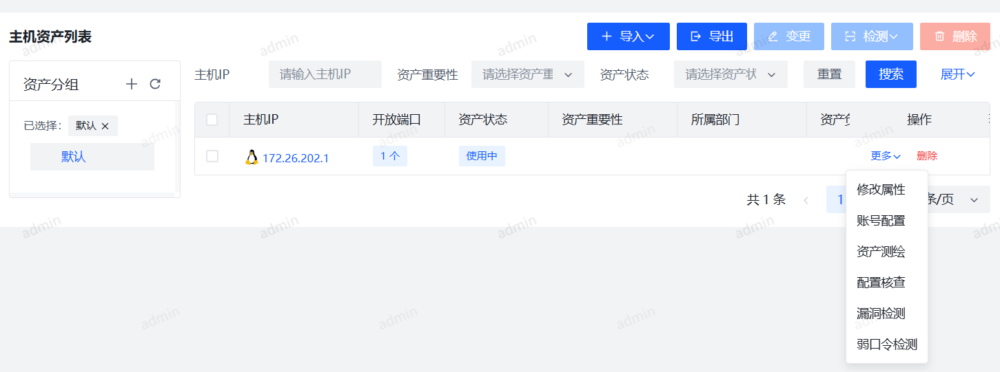

### 2. 漏洞管理

&nbsp;&nbsp;提供漏洞的全生命周期管理，涵盖漏洞的发现、评估、修复、验证、记录、统计分析等，系统还支持商业漏扫报告解析，将漏洞纳入统一管理。通过一站式的管理方案，降低安全管理风险，构建持续改进的安全运营闭环。
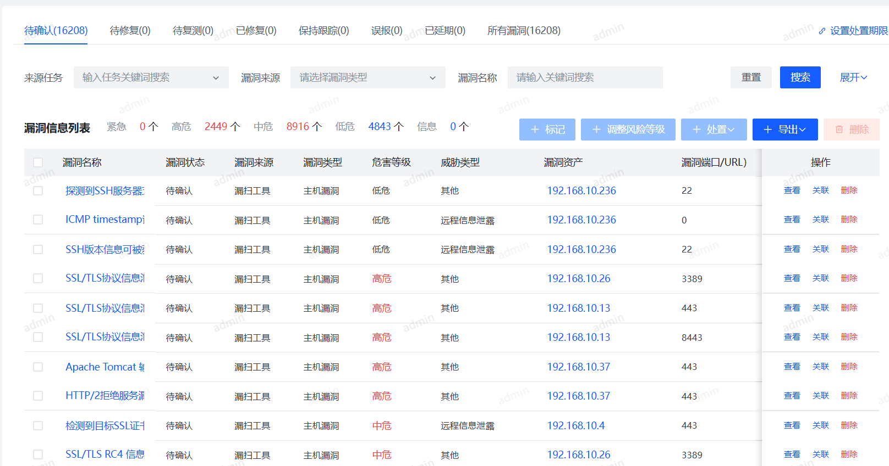

### 3. 资产测绘

&nbsp;&nbsp;资产测绘是用于对网络空间中的资产进行全面梳理、识别和定位的技术和方法，主要用于发现和管理企业或组织在网络中的各类资产，包括硬件设备、软件系统、服务等，通过资产测绘可迅速定位网络中的各类资产，收敛暴露资产，减少攻击面。
&nbsp;&nbsp;**主机测绘：**主机资产测绘用于帮助用户发现目标网络环境中未被发现和掌握的主机资产，系统通过多线程并发方式对目标主机端口进行扫描和指纹识别，扫描目标支持ＩＰ范围和子网格式，内置常见扫描端口模板，并提供线程设置。
&nbsp;&nbsp;**应用测绘：**应用测绘作为高度集成的网络空间资产测绘工具，其核心功能不仅包括端口扫描、目录探测、子域爆破和指纹识别，还融合了以下关键技术与应用场景：

- 多层次扫描技术
  端口扫描：基于应用资产，识别开放的其他端口及服务类型（如HTTP、SSH、数据库服务等）。
  子域爆破：通过字典枚举或搜索引擎发现隐藏子域，结合DNS解析获取关联IP。
  目录探测：基于工具爆破敏感路径，识别未公开的API、管理后台或配置文件泄露。
- 智能指纹识别
  通过Banner抓取、SSL证书解析、协议特征匹配识别服务类型及版本。
- 自动化与关联分析
  自动聚合子域名、端口、服务等数据，与用户现有资产进行关联分析，能识别出新资产和失效资产，并提供不同视角查看资产情况和资产认领。

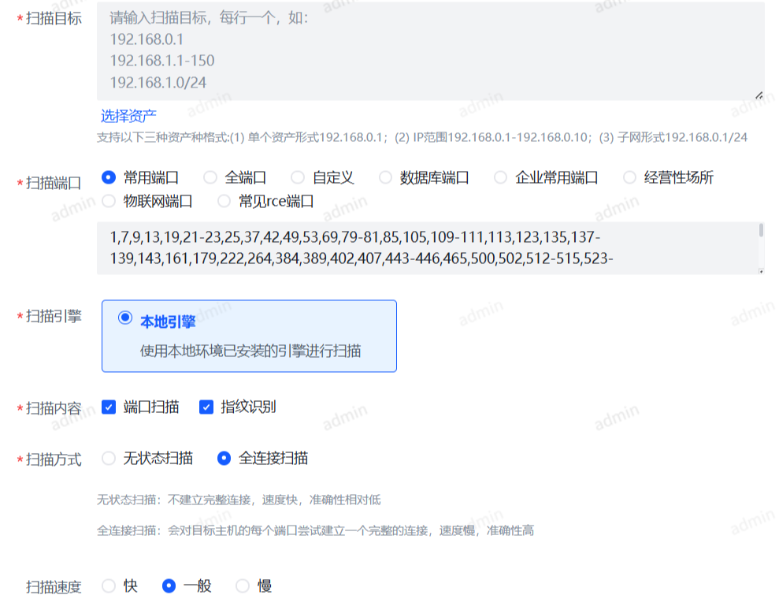
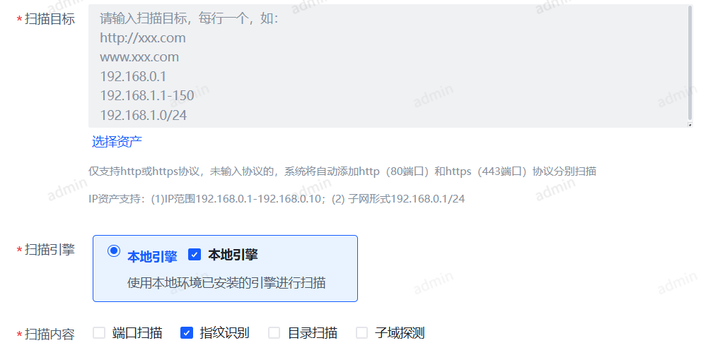

### 4. 配置核查

&nbsp;&nbsp;提供主机批量化远程配置核查功能，确保系统配置符合安全标准。该功能采用无代理架构，直接通过ＳＳＨ协议与目标系统建立连接，无需在目标系统上安装任何代理软件，从而减少了对目标系统的侵入性，降低了安全风险。其核心在于通过远程扫描、分析、评估、测试及自动加固技术，实现对服务器操作系统全面安全配置核查和加固。系统预置等保2.0要求检查项，支持Windows/Linux操作系统核查，支持自定义检查基线，可根据检查要求进行灵活定制。
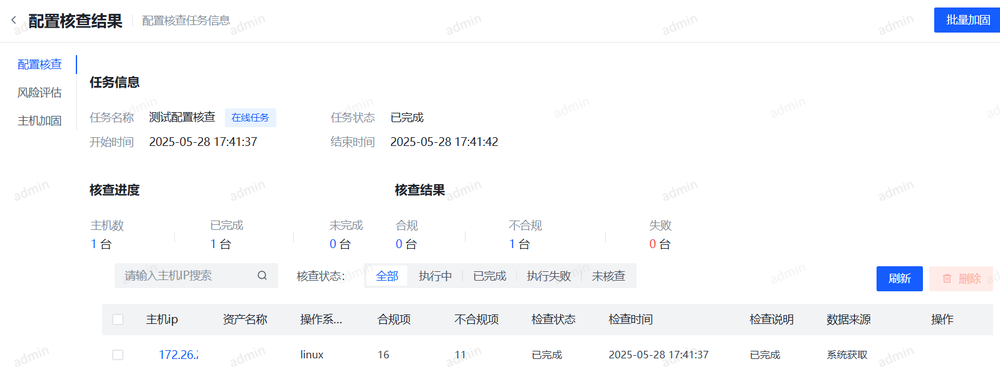

### 5. 漏洞检测

&nbsp;&nbsp;漏洞检测功能基于nuclei实现，通过预定义的或自定义的 YAML 模板（称为 Nuclei Templates）对目标进行自动化扫描，支持多种协议（HTTP、DNS、TCP等），能够高效精准地识别潜在安全威胁，提供可视化的ＰＯＣ模板管理界面，方便快速导入收集的ｐｏｃ模板。检测目标支持按ＩＰ范围、子网、ＵＲＬ形式。
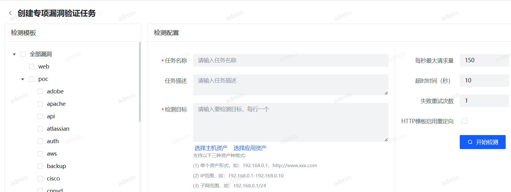

### 6. 弱口令检测

&nbsp;&nbsp;弱口令检测用于检测系统中可能存在的弱密码风险，支持４６种协议，包括SSH、ＲＤＰ、ＰＯＰ３、ＦＴＰ、Telnet、MySQL等。可以帮助用户快速发现系统中的弱密码账号，提前发现安全隐患。系统内置高频使用爆破的字典库，同时支持用户自定义上传和管理字典文件。

### 7. 主机运维

&nbsp;&nbsp;提供在线终端 SSH 服务，支持快捷命令、自定义快捷键和主题风格，旨在为用户打造一个高度个性化且高效便捷的远程操作环境。用户无需繁琐配置，即可快速接入远程服务器，执行各类复杂任务（需要先录入主机资产和账号）。

### 8. 批量执行

&nbsp;&nbsp;支持批量执行主机命令、多主机文件分发等功能，可极大提升运维人员的工作效率，减少重复性劳动。通过预设的命令模板或自定义脚本，运维人员能够一次性在多台主机上执行相同的操作，无论是系统更新、配置修改还是日志收集，都能迅速完成，确保各主机环境的一致性。同时，多主机文件分发功能使得软件安装包、配置文件等能够快速且准确地部署到指定主机，避免了手动逐台传输的繁琐与易错。此外，该系统还支持任务调度与自动化执行，可根据预设时间或触发条件自动执行命令与文件分发任务，实现运维工作的智能化与无人值守化，为企业节省大量人力与时间成本，保障业务系统的稳定高效运行。

### 9. 日志审计

&nbsp;&nbsp;记录用户操作日志，提供审计功能，是保障系统安全与合规性的重要举措。通过详细记录用户的每一次操作行为，包括操作时间、操作类型、操作对象以及操作结果等关键信息，系统管理员能够全面掌握用户的活动轨迹。这些日志数据不仅有助于在出现问题时快速定位故障源头，还能为安全事件的调查提供有力证据。例如，当系统出现异常数据修改时，管理员可以回溯日志，找出具体是哪个用户在何时进行了相关操作，从而判断是误操作还是恶意行为。同时，审计功能也能对用户行为起到一定的约束作用。用户知晓自己的操作会被记录，就会更加谨慎地操作系统，减少违规操作的可能性。此外，定期对操作日志进行分析，还能发现系统使用过程中的潜在风险和优化点，进一步提升系统的安全性和稳定性。

## 安装使用

&nbsp;&nbsp;安全运维工具箱开箱即用，系统运行依赖环境已全部集成在程序包内，并提供桌面可视化管理界面。

- 环境要求
  Windows 7/10/Server 2012+
  Npcap 1.80+（主机和应用资产测绘依赖，请在使用资产测绘功能前先安装npcap）
- 程序包目录结构
  bin：启动程序所在目录
  data：系统初始化后数据库文件存放目录
  env：系统运行依赖的环境
  etc：系统配置目录
  lib：系统依赖包目录
  logs：系统运行日志文件目录
  resources：系统使用的资源目录
- 使用步骤
  
  第一步：下载最新版本
  https://github.com/nbyiansec/sskit/releases

  第二步：运行程序。解压后，在／ｂｉｎ目录下找到“安全运维工具箱．ｅｘｅ”文件，双击打开系统管理界面，管理界面提供启动、停止、重启、卸载操作。（注意：解压目录中不能包含空格、中文字符、其他特殊字符，否则运行失败，如安装有杀毒软件建议将解压目录加白名单） 
  启动：启动系统，当窗口标题显示“运行中”表示启动成功。第一次启动较慢，系统需要初始化环境和数据。 
  停止：停止系统，系统将安全停止所有服务进程，等待服务完全停止后方可进行其他操作。 
  重启：重启系统。 
  卸载：卸载系统数据，系统将完全移除所有运行数据，卸载操作不可逆，操作前请确保重要数据已备份。 
  查看日志：点击右下角查看日志，日志区域会显示启动过程信息。 
  第三步：访问系统。打开浏览器输入：https://127.0.0.1:57701/kit/index.html，默认账号：admin/Admin@1290。

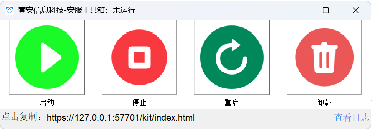

## 功能预览

#### 1. 资产管理

- 应用资产管理

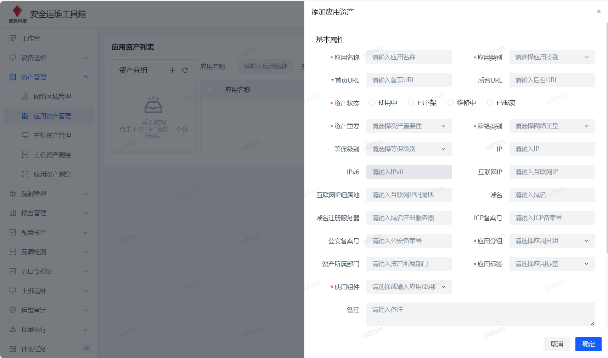

- 主机资产管理

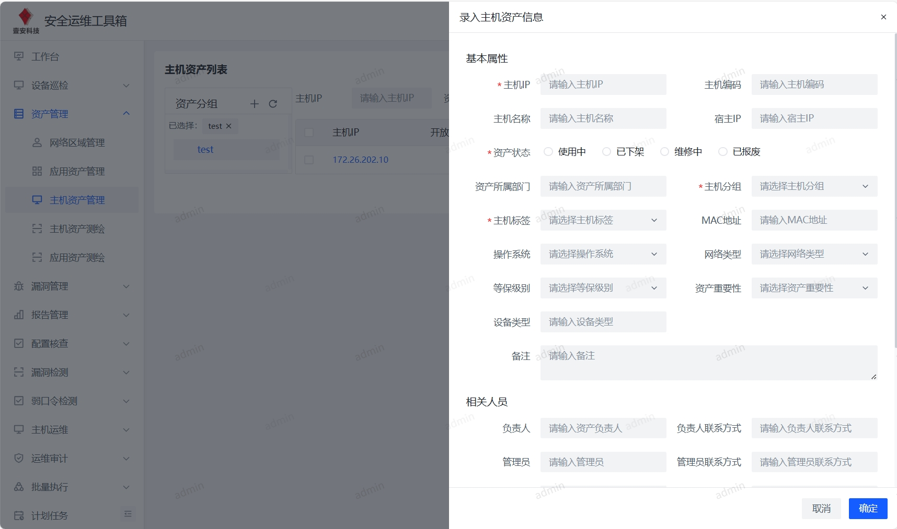

#### 2. 漏洞管理

- 漏洞发现

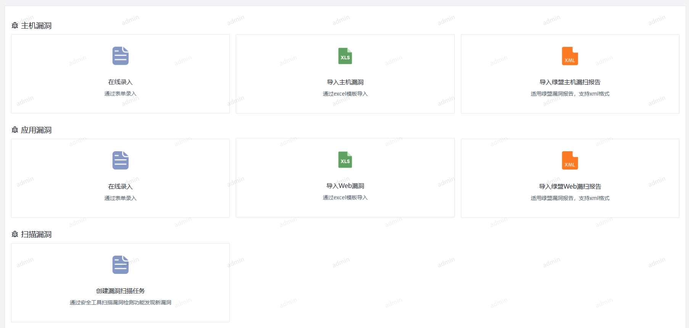

- 漏洞跟踪

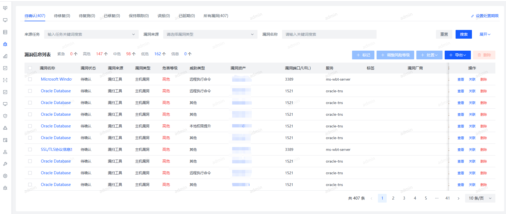

#### 3. 配置核查

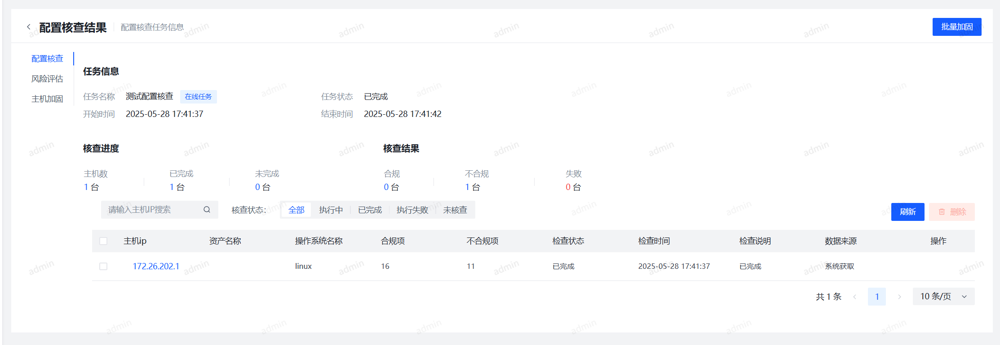

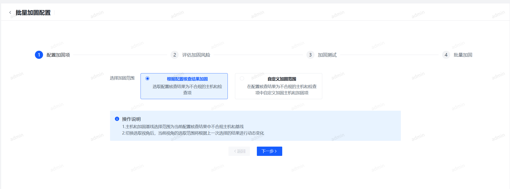

#### 4. 资产测绘

- 主机资产测绘

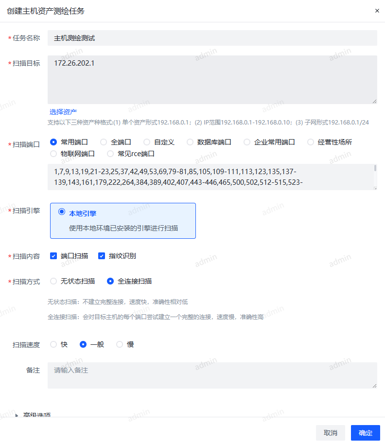
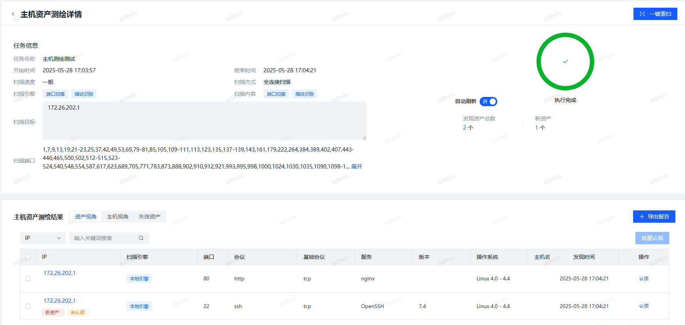

- 应用资产测绘

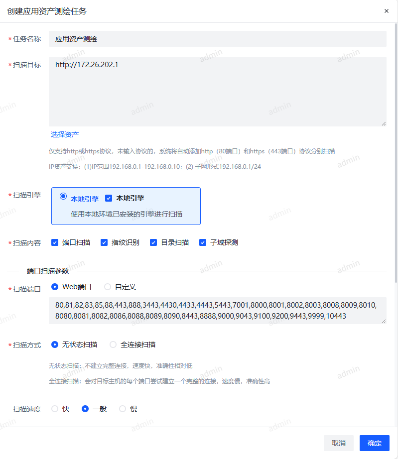
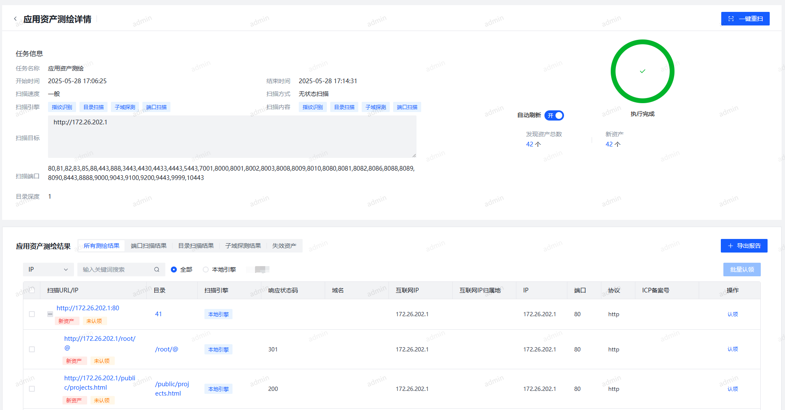

#### 5. 漏洞检测

- 漏洞检测

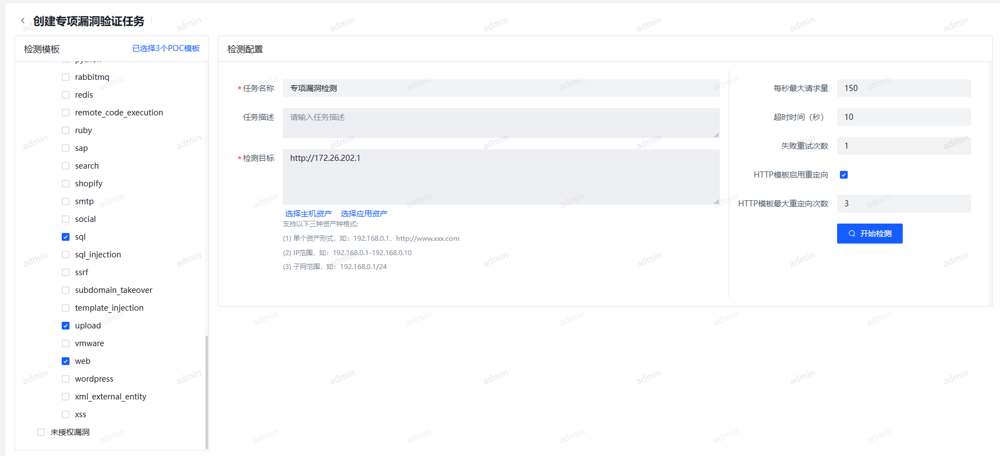

- ｐｏｃ模板管理

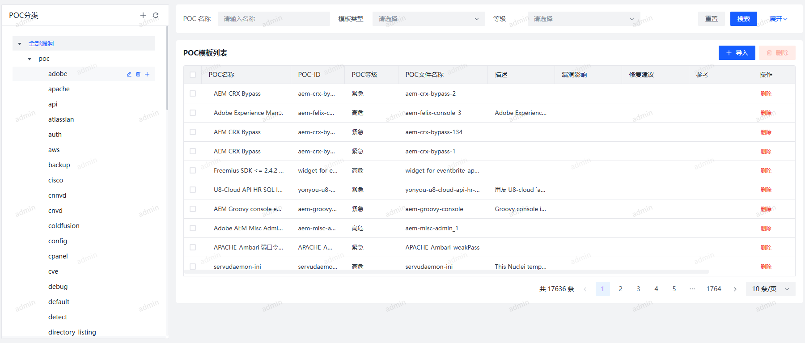

#### 6. 弱口令检测

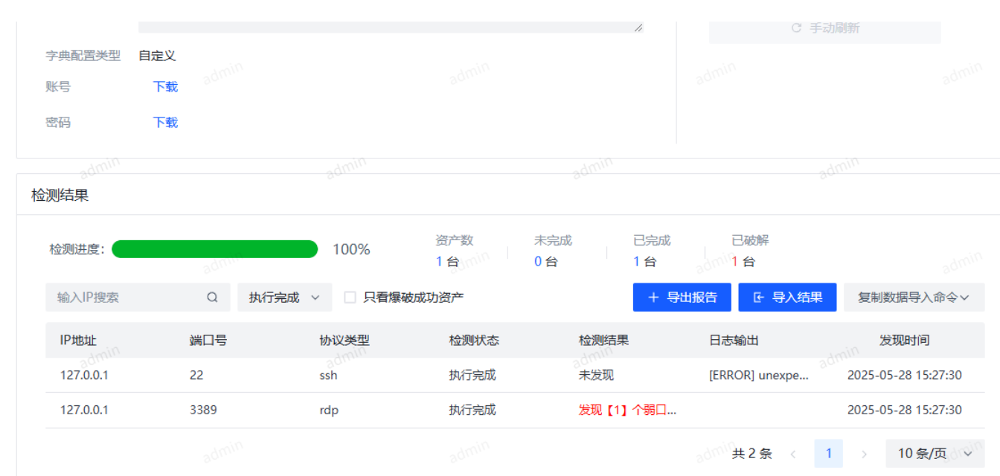

#### 7.主机运维

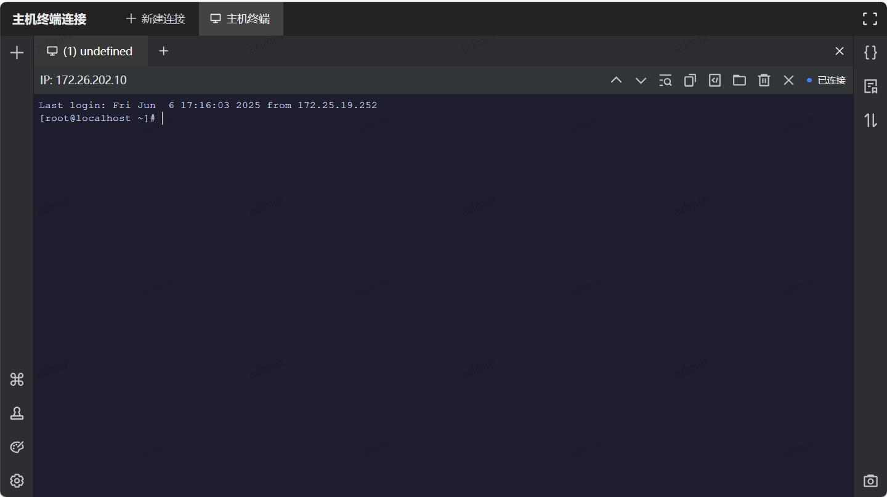

#### 8.批量执行

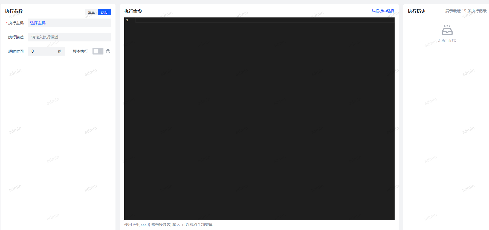
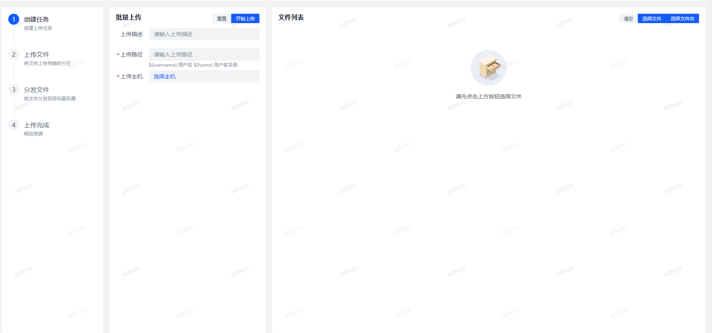

#### 9.运维审计

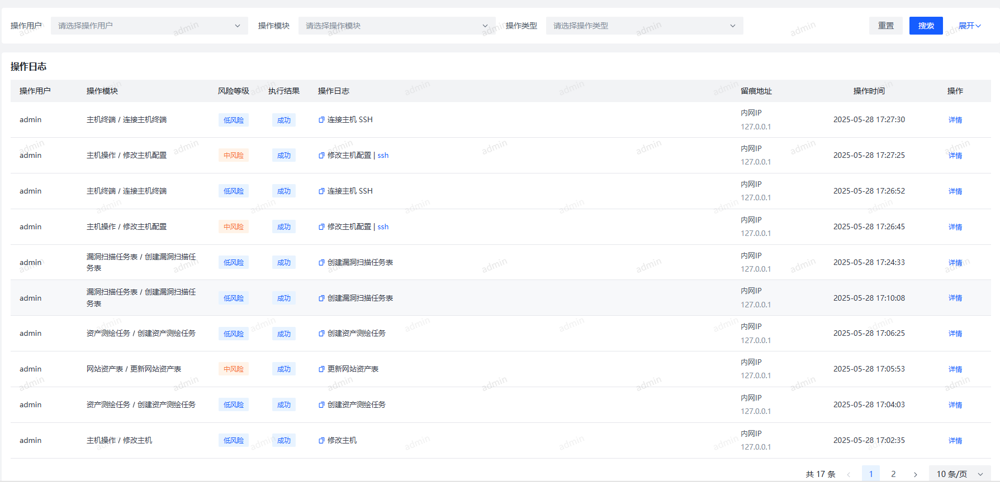

## 常见问题解答

1. 初始化失败
   若安全运维工具箱第一次运行时提示初始化失败，请检查安装路径中是否包含中文或特殊符号（如 “-”）。
2. 升级失败
   为避免升级失败，建议采取以下措施：将工具箱安装至除 C 盘以外的目录，防止因权限问题影响升级操作；建议升级前先将安全运维工具箱目录加白名单，避免被误杀。
3. 配置核查、弱口令检测、漏洞扫描、资产测绘失败
   可能原因是杀毒软件误杀，将依赖组件清除，导致扫描失败。请检查杀毒软件隔离区或日志，恢复被清除的工具，并将安全运维工具箱文件添加至信任列表。
4. 漏洞检测执行失败提示 “执行命令失败”
   若出现该提示，请检查 POC 模板是否完成初始化，确保模板配置正确后重新执行任务。

## 关于我

&nbsp;&nbsp;壹安科技是国内首批聚焦网络安全服务的专业技术公司，公司专注网络和数据安全技术研究与应用，为企业提供技术咨询、运维管理、应急保障等一站式专业安全服务，打通网络安全管理最后一公里，构建完整安全防护体系，实现信息系统风险全生命周期管理。
公司总结多年一线安全服务经验与技术研究成果，针对性研发出安全运维工具箱等技术工具与平台，为广大网络安全从业人员提供专业技术支持。

## 联系我

&nbsp;&nbsp;使用过程中有任何问题，或者对项目有什么想法或者建议，可以提交issues，将不定期进行回复和解决问题。如有合作/功能定制需求请加微信，备注: 合作。

## 致谢

特别感谢以下项目的作者，你们的无私分享为软件开发提供了坚实基础。

https://github.com/dromara/orion-visor 
https://github.com/EdgeSecurityTeam/EHole 
https://github.com/maurosoria/dirsearch 
https://github.com/nmap/nmap 
https://github.com/shmilylty/OneForAll 

## 用户义务

1. 未经商业授权，禁止将本软件用于任何盈利活动（包括但不限于商业培训、 SaaS服务、嵌入式系统销售等）。
2. 禁止移除或修改软件中的logo标识和版权申明。

## 免责申明

&nbsp;&nbsp;本工具仅能在取得足够合法授权的企业安全建设中使用，在使用本工具过程中，您应确保自己所有行为符合当地的法律法规。 禁止将软件用于违法用途，如您在使用本工具的过程中存在任何非法行为，您将自行承担所有后果，本工具所有开发者和所有贡献者不承担任何法律及连带责任。使用本软件产生的任何直接/间接损失（如数据丢失、业务中断等），开发者概不负责。 除非您已充分阅读、完全理解并接受本协议所有条款，否则，请您不要安装并使用本工具。 您的使用行为或者您以其他任何明示或者默示方式表示接受本协议的，即视为您已阅读并同意本协议的约束。
